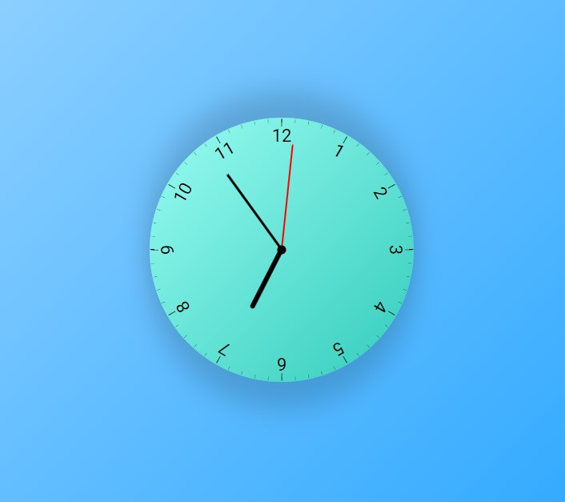

# Analog Clock

[This project](https://gurhan-analog-clock.netlify.app/) is a an anolog clock app which monitors the computer's time and displays in anolog clock format.

## Table of contents

- [Analog Clock](#analog-clock)
  - [Table of contents](#table-of-contents)
  - [Overview](#overview)
    - [The challenge](#the-challenge)
    - [Screenshot](#screenshot)
    - [Links](#links)
  - [My process](#my-process)
    - [Built with](#built-with)

## Overview

### The challenge

Users should be able to:

-   View the optimal layout for the app depending on their device's screen size
-   See hover states for all interactive elements on the page
-   See the computer's time in anolog clock format.

### Screenshot

### Links

-   Solution URL: [Live Website](https://gurhan-analog-clock.netlify.app/)

## My process

### Built with

-   Semantic HTML5 markup
-   CSS custom properties
-   CSS Flexbox
-   Desktop-first workflow
-   Javascript
